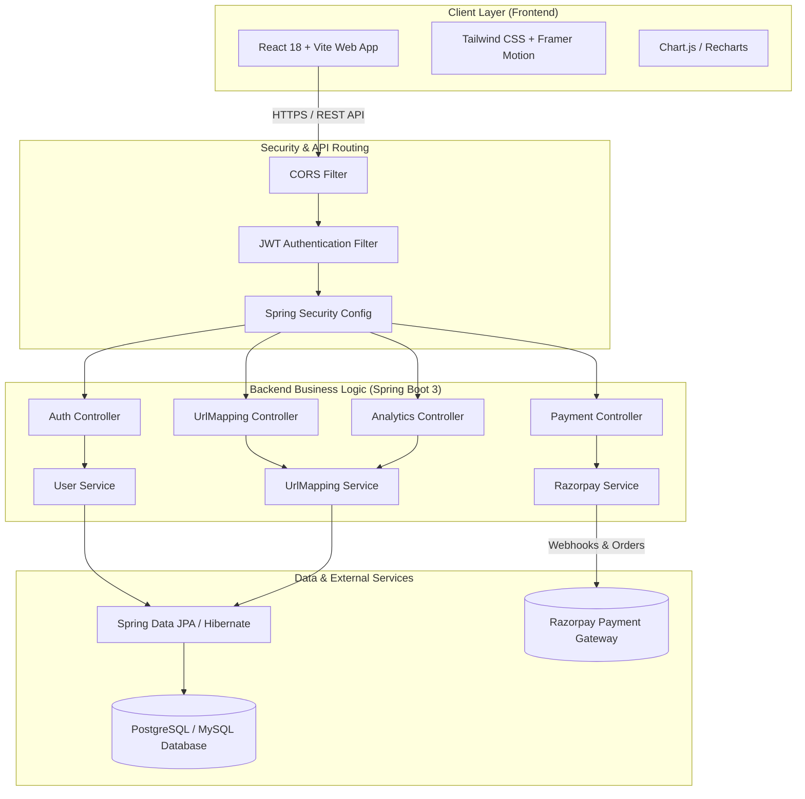
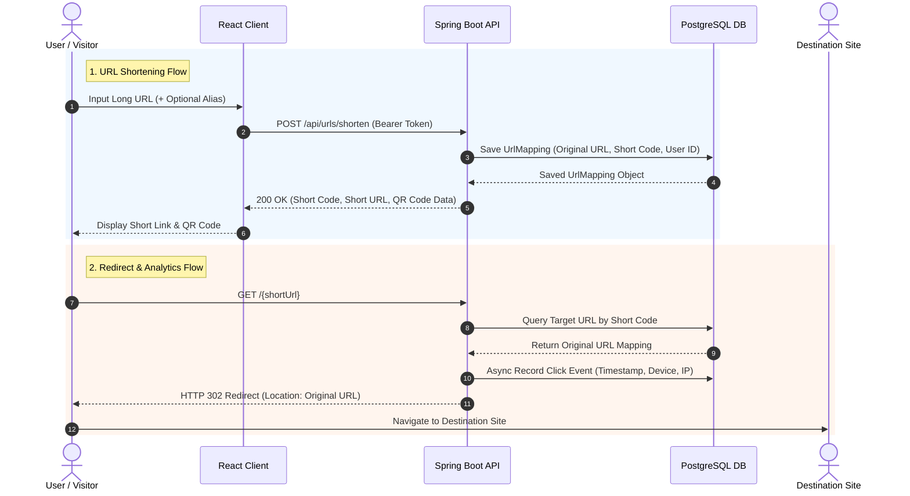
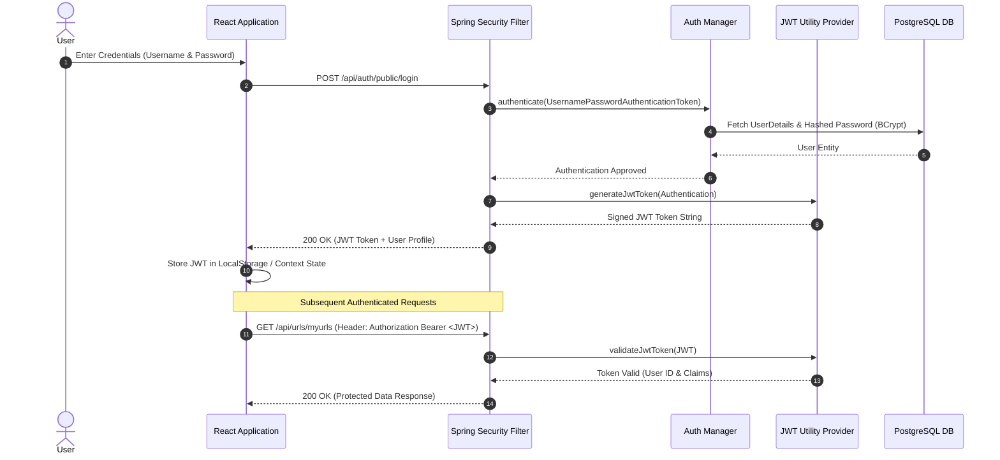

<div align="center">

  # 🚀 Snipr
  ### *Enterprise-Grade Full-Stack URL Shortener & Analytics Platform*

  [](https://spring.io/projects/spring-boot)
  [](https://reactjs.org/)
  [](https://tailwindcss.com/)
  [](https://www.postgresql.org/)
  [](https://jwt.io/)
  [](LICENSE)

  [Live Demo](https://url-shortener-gilt-xi.vercel.app) • [API Endpoint](https://snpir-api-efba05eb7099.herokuapp.com) • [Report Bug](https://github.com/hxrshityadav/URL_Shortener/issues) • [Request Feature](https://github.com/hxrshityadav/URL_Shortener/issues)

</div>

---

## 📌 Table of Contents

- [Overview](#-overview)
- [Key Features](#-key-features)
- [System Architecture & Diagrams](#-system-architecture--diagrams)
  - [High-Level System Architecture](#high-level-system-architecture)
  - [URL Shortening & Redirection Flow](#url-shortening--redirection-flow)
  - [JWT Authentication Sequence](#jwt-authentication-sequence)
- [Tech Stack](#-tech-stack)
- [Project Directory Structure](#-project-directory-structure)
- [Step-by-Step Installation & Local Setup Guide](#-step-by-step-installation--local-setup-guide)
  - [1. Prerequisites](#1-prerequisites)
  - [2. Clone the Repository](#2-clone-the-repository)
  - [3. Database Setup](#3-database-setup)
  - [4. Backend Configuration & Launch](#4-backend-configuration--launch)
  - [5. Frontend Configuration & Launch](#5-frontend-configuration--launch)
- [Environment Variables](#-environment-variables)
- [Core REST API Reference](#-core-rest-api-reference)
- [Deployment Guide](#-deployment-guide)
- [Contributing](#-contributing)
- [License](#-license)

---

## 🔗 Overview

**Snipr** is a full-stack, production-ready URL shortening and link management platform built with a high-performance **Spring Boot 3** backend and a responsive **React 18** frontend. 

It provides seamless link shortening, custom link alias creation, instant QR code generation, real-time click analytics, user subscription tier management powered by Razorpay, and multi-language internationalization (i18n).

> **Architectural Goal:** Demonstrates enterprise software architecture, stateless JWT security, clean database layer persistence with Spring Data JPA/Hibernate, and interactive frontend data visualization using Chart.js & Framer Motion.

---

## ✨ Key Features

| Category | Features |
| :--- | :--- |
| 🔗 **Link Management** | • Shorten long URLs into compact, shareable short links.<br>• Custom link alias support.<br>• Instant QR Code generation for any link.<br>• Automated high-speed HTTP 302 redirections. |
| 📊 **Real-time Analytics** | • Click counts & timestamped tracking.<br>• Interactive analytics dashboard with Chart.js & Recharts.<br>• Device & click volume metrics over custom date ranges. |
| 🔒 **Security & Auth** | • Stateless JWT authentication & role-based authorization.<br>• Encrypted password storage using BCrypt.<br>• Granular CORS filters and secure response headers. |
| 💳 **Monetization & Billing** | • Tiered membership plans (Free, Pro, Business).<br>• Seamless Razorpay payment gateway integration.<br>• Automated webhooks for subscription management. |
| 🌐 **Modern UX & i18n** | • Built with React 18, Vite, and Tailwind CSS.<br>• Smooth micro-animations with Framer Motion.<br>• Multi-language UI support via `i18next`. |

---

## 📊 System Architecture & Diagrams

### High-Level System Architecture



---

### URL Shortening & Redirection Flow



---

### JWT Authentication Sequence



---

## 🛠️ Tech Stack

### Frontend
- **Framework:** [React 18](https://reactjs.org/) + [Vite](https://vitejs.dev/)
- **Styling:** [Tailwind CSS](https://tailwindcss.com/) + [Emotion](https://emotion.sh/) + [MUI](https://mui.com/)
- **State & Routing:** [React Router v7](https://reactrouter.com/), [React Query](https://tanstack.com/query)
- **Animations:** [Framer Motion](https://www.framer.com/motion/)
- **Charts & Data:** [Chart.js](https://www.chartjs.org/), [Recharts](https://recharts.org/)
- **Internationalization:** [i18next](https://www.i18next.com/)

### Backend
- **Framework:** [Spring Boot 3.x](https://spring.io/projects/spring-boot) (Java 17)
- **Security:** [Spring Security](https://spring.io/projects/spring-security) + JWT (`jjwt`)
- **Persistence:** [Spring Data JPA](https://spring.io/projects/spring-data-jpa) / [Hibernate](https://hibernate.org/)
- **Build Tool:** Apache Maven
- **Payments:** Razorpay Java SDK

### Database & Infrastructure
- **Database:** PostgreSQL (Production / Local) or MySQL
- **Containerization:** Docker & Docker Compose
- **Hosting:** Heroku (Backend API), Vercel (Frontend UI)

---

## 📁 Project Directory Structure

```
URL_Shortener/
├── Backend/                       # Spring Boot Application
│   ├── src/main/java/com/url/shortener/
│   │   ├── controller/            # REST Controllers (Auth, URL, Analytics, Payment)
│   │   ├── dtos/                  # Request & Response Data Transfer Objects
│   │   ├── models/                # JPA Entities (User, UrlMapping, ClickEvent)
│   │   ├── repository/            # Spring Data JPA Repositories
│   │   ├── security/              # JWT Filters, UserDetails & Security Config
│   │   └── service/               # Business Logic & Razorpay Integration
│   ├── src/main/resources/
│   │   ├── application.properties      # Development Configuration
│   │   └── application-prod.properties # Production Configuration
│   ├── Dockerfile                 # Multi-Stage Backend Container Build
│   └── pom.xml                    # Maven Configuration & Dependencies
│
├── Frontend/                      # React 18 + Vite Web Client
│   ├── src/
│   │   ├── components/            # UI Components (Dashboard, Analytics, Auth)
│   │   ├── context/               # Global React Context State (Auth Context)
│   │   ├── api/                   # Axios API Interceptors & Service Calls
│   │   ├── i18n/                  # Multi-language Translation Bundles
│   │   ├── App.jsx                # Main Application Router
│   │   └── index.css              # Global Tailwind Styles
│   ├── package.json               # NPM Dependencies & Build Scripts
│   ├── tailwind.config.js         # Custom Tailwind Design System Tokens
│   └── vite.config.js             # Vite Server Configuration
│
└── README.md                      # Complete Project Documentation
```

---

## ⚡ Step-by-Step Installation & Local Setup Guide

Follow these step-by-step instructions to set up and run **Snipr** on your machine.

---

### 1. Prerequisites

Make sure you have the following installed:
- **Java JDK 17** or higher (`java -version`)
- **Node.js v18.x** or higher & **npm** (`node -v`, `npm -v`)
- **PostgreSQL 15+** or **Docker Desktop**
- **Git** (`git --version`)

---

### 2. Clone the Repository

Clone the project from GitHub and enter the root directory:

```bash
git clone https://github.com/hxrshityadav/URL_Shortener.git
cd URL_Shortener
```

---

### 3. Database Setup

You can run PostgreSQL either locally or using Docker.

#### Option A: Local PostgreSQL Setup
Create a database named `url_shortener` using `psql` or pgAdmin:

```sql
CREATE DATABASE url_shortener;
```

#### Option B: Docker Setup
Run a PostgreSQL container:

```bash
docker run --name postgres-snipr -e POSTGRES_DB=url_shortener -e POSTGRES_USER=postgres -e POSTGRES_PASSWORD=postgres -p 5433:5432 -d postgres:15
```

---

### 4. Backend Configuration & Launch

1. Navigate to the `Backend` directory:
   ```bash
   cd Backend
   ```

2. Review or update `src/main/resources/application.properties`:
   ```properties
   spring.datasource.url=jdbc:postgresql://localhost:5433/url_shortener
   spring.datasource.username=postgres
   spring.datasource.password=postgres
   jwt.secret=snipr-dev-jwt-hmac-secret-at-least-thirty-two-bytes-long
   ```

3. Build and launch the Spring Boot backend server:

   - **Windows (PowerShell / CMD):**
     ```powershell
     .\mvnw.cmd spring-boot:run
     ```
   - **macOS / Linux:**
     ```bash
     ./mvnw spring-boot:run
     ```

4. The backend server will start at **`http://localhost:8080`**.

---

### 5. Frontend Configuration & Launch

1. Open a new terminal and navigate to the `Frontend` directory:
   ```bash
   cd Frontend
   ```

2. Install npm dependencies:
   ```bash
   npm install
   ```

3. Verify or create the `.env` file in the `Frontend` root directory:
   ```env
   VITE_BACKEND_URL=http://localhost:8080
   VITE_REACT_FRONT_END_URL=http://localhost:5173
   ```

4. Start the Vite development server:
   ```bash
   npm run dev
   ```

5. Open your browser and visit **`http://localhost:5173`**.

---

## 🔑 Environment Variables

### Backend (`Backend/src/main/resources/application.properties`)

| Environment Variable | Default Value | Description |
| :--- | :--- | :--- |
| `SPRING_DATASOURCE_URL` | `jdbc:postgresql://localhost:5433/url_shortener` | PostgreSQL Database Connection URL |
| `SPRING_DATASOURCE_USERNAME` | `postgres` | Database Username |
| `SPRING_DATASOURCE_PASSWORD` | `postgres` | Database Password |
| `JWT_SECRET` | `snipr-dev-jwt-hmac-secret...` | HMAC SHA signing secret for JWT |
| `FRONTEND_URL` | `http://localhost:5173` | CORS allowed origin for frontend client |
| `RAZORPAY_KEY_ID` | `""` *(Optional)* | Razorpay Payment Key ID |
| `RAZORPAY_KEY_SECRET` | `""` *(Optional)* | Razorpay Payment Secret |

### Frontend (`Frontend/.env`)

| Variable Name | Default Value | Description |
| :--- | :--- | :--- |
| `VITE_BACKEND_URL` | `http://localhost:8080` | URL of the backend Spring Boot API server |
| `VITE_REACT_FRONT_END_URL` | `http://localhost:5173` | Frontend application client URL |

---

## 🌐 Core REST API Reference

| HTTP Method | Endpoint Path | Auth Required | Description |
| :--- | :--- | :---: | :--- |
| `POST` | `/api/auth/public/register` | ❌ No | Register a new user account |
| `POST` | `/api/auth/public/login` | ❌ No | Authenticate user & receive JWT token |
| `POST` | `/api/urls/shorten` | 🔒 Yes | Create a short URL with optional alias |
| `GET` | `/api/urls/myurls` | 🔒 Yes | Fetch all URLs created by the logged-in user |
| `GET` | `/api/urls/analytics/{shortUrl}` | 🔒 Yes | Fetch click analytics for a specific short link |
| `GET` | `/{shortUrl}` | ❌ No | Public HTTP 302 redirection to original target URL |
| `POST` | `/api/payments/create-order` | 🔒 Yes | Create a Razorpay subscription payment order |

---

## 🚀 Deployment Guide

- **Backend Containerization:** A production multi-stage `Dockerfile` is included in `/Backend/Dockerfile`. Build the Docker image:
  ```bash
  docker build -t snipr-backend ./Backend
  ```
- **Frontend Production Build:** Build the static SPA distribution:
  ```bash
  cd Frontend
  npm run build
  ```
  The built files in `dist/` can be deployed on Vercel, Netlify, or AWS S3 + CloudFront.

---

## 🤝 Contributing

Contributions are welcome! Follow these steps:

1. Fork the Repository
2. Create your Feature Branch (`git checkout -b feature/AmazingFeature`)
3. Commit your Changes (`git commit -m 'Add some AmazingFeature'`)
4. Push to the Branch (`git push origin feature/AmazingFeature`)
5. Open a Pull Request

---

## 📄 License

Distributed under the **MIT License**. See `LICENSE` for more information.

<div align="center">
  <sub>Designed & Developed by <a href="https://github.com/hxrshityadav">Harshit Yadav</a>. Built with ❤️ for developers worldwide.</sub>
</div>
